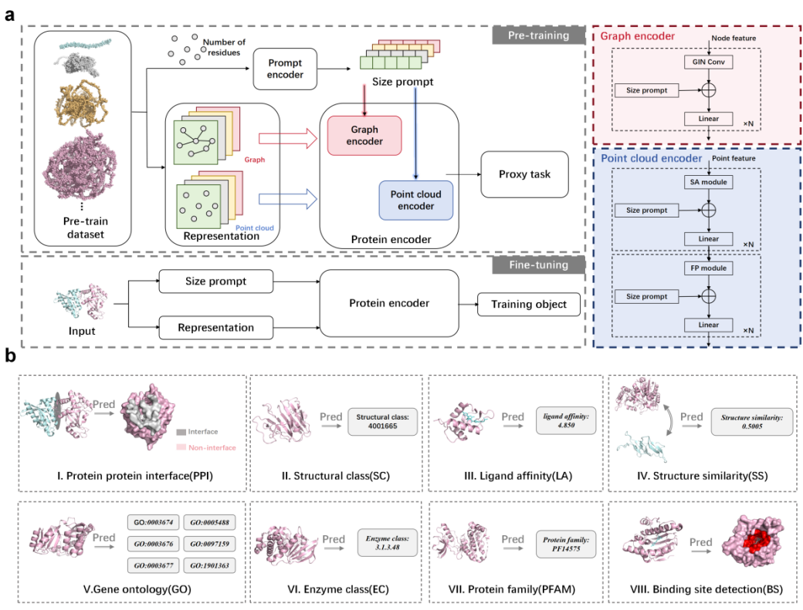

# ProSP


# 📚 Overview
We design a novel protein self-supervised representation learning method with a protein size prompt (ProSP). In ProSP, we encode the protein size, specifically the number of residues in a protein, into a prompt vector, which is then plugged into a base protein encoder to make the base encoder learn a general representation under the condition of protein size. The whole model is pre-trained on large unlabeled dataset so that it can be adapted to proteins of different sizes in different tasks. We plug the protein size prompt into two common existing base encoders for structural protein representation learning (graph and point cloud) to study its potential in improving downstream task performance. 



# 🔬 Installation

One can use `conda`, `mamba` or `pip` to download required packages. The main dependecies are:

```bash
proteinshake
pytorch
pyg
pytorch-lightning
hydra
```

An example for installing `ProteinShake_eval` with `mamba` (similar but faster than `conda`):

```bash
mamba create -n proteinshake
mamba activate proteinshake
mamba install pytorch pytorch-cuda=11.8 -c pytorch -c nvidia
mamba install pyg -c pyg
mamba install lightning
pip install hydra-core --upgrade
pip install proteinshake
pip install -e .
```

# 🤖  Model weights

The weights for pre-trained models are available [in the repository](https://github.com/ShenAoAO/ProSP/tree/main/pretrained).

# 🚀  Training

#### Supervised training/Finetuning

Train a graph neural network from scratch for the Enzyme Class prediction task:
```bash
python experiments/train.py task=enzyme_class representation=graph
```

Finetune a PointNet++ for the Ligand Affinity prediction task:
```bash
python experiments/train.py task=ligand_affinity representation=point_cloud pretrained=true
```

Use `python experiments/train.py` to see more details.

#### Pretraining with masked residue prediction

```bash
python experiments/pretrain_mask_residues.py representation=graph
```

#### Using pretrained models with custom prediction heads

You can easily use the provided models and weights to add your own prediction heads to the pretrained models.
The below code example shows how to prepare the data and load the model weights for the graph model.
See also `proteinshake_eval/models/` for models of the other representations, and `config/` for the correct parameters.

The pretrained models return an embedding of the entire protein (`global_pool=mean`) or of the residues (`global_pool=None`) which you can use in your own model. As it is a torch module, you can use it like any other layer.

```python
from proteinshake.tasks import EnzymeClassTask
from proteinshake_eval.models.graph import GNN_encoder
from proteinshake_eval.transforms.graph import GraphTrainTransform
from torch_geometric.loader import DataLoader

# prepare the data
task = EnzymeClassTask()
data_transform = GraphTrainTransform(task)
task = task.to_graph(eps=8).pyg(transform=data_transform)

# load the model and pretrained weights
model = GNN_encoder(embed_dim=256, num_layers=5, global_pool='mean')
model.from_pretrained('pretrained/graph/model.pt')

# run some inference
loader = DataLoader(task.dataset)
print(model.forward(next(iter(loader))))
```
